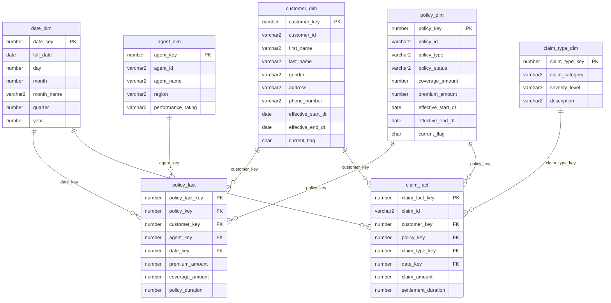

# 🗄️ Insurance Data Warehouse Schema

> Fact and dimension table design for the **Insurance Data Warehouse**, built on Oracle 9i using a Kimball-style star schema.

---

## 📌 Schema Overview

| Table | Type | SCD | Purpose |
|---|---|---|---|
| `date_dim` | Dimension | — | Calendar hierarchy for time-based joins |
| `customer_dim` | Dimension | Type 2 | Customer demographics & contact history |
| `policy_dim` | Dimension | Type 1 / 2 | Policy type, status, and coverage details |
| `agent_dim` | Dimension | — | Agent details and performance rating |
| `claim_type_dim` | Dimension | — | Claim category and severity classification |
| `policy_fact` | Fact | — | Premium, coverage, and policy duration metrics |
| `claim_fact` | Fact | — | Claim amount and settlement duration metrics |

---

## 🧩 Entity Relationship Diagram



---

## 1️⃣ Date Dimension

Calendar hierarchy used to join facts to time periods.

```sql
CREATE TABLE date_dim (
    date_key      NUMBER          PRIMARY KEY,
    full_date     DATE,
    day           NUMBER,
    month         NUMBER,
    month_name    VARCHAR2(20),
    quarter       NUMBER,
    year          NUMBER
);
```

---

## 2️⃣ Customer Dimension — `SCD Type 2`

Tracks customer demographic and contact changes over time.

```sql
CREATE TABLE customer_dim (
    customer_key          NUMBER           PRIMARY KEY,
    customer_id           VARCHAR2(20),
    first_name            VARCHAR2(50),
    last_name             VARCHAR2(50),
    gender                VARCHAR2(10),
    address               VARCHAR2(200),
    phone_number          VARCHAR2(20),
    effective_start_dt    DATE,
    effective_end_dt      DATE,
    current_flag          CHAR(1)
);
```

---

## 3️⃣ Policy Dimension — `SCD Type 1 / Type 2`

Tracks policy attributes; corrections overwrite, coverage changes version.

```sql
CREATE TABLE policy_dim (
    policy_key            NUMBER          PRIMARY KEY,
    policy_id             VARCHAR2(20),
    policy_type           VARCHAR2(50),
    policy_status         VARCHAR2(20),
    coverage_amount       NUMBER,
    premium_amount        NUMBER,
    effective_start_dt    DATE,
    effective_end_dt      DATE,
    current_flag          CHAR(1)
);
```

---

## 4️⃣ Agent Dimension

Descriptive attributes for insurance agents.

```sql
CREATE TABLE agent_dim (
    agent_key             NUMBER           PRIMARY KEY,
    agent_id              VARCHAR2(20),
    agent_name            VARCHAR2(100),
    region                VARCHAR2(50),
    performance_rating    VARCHAR2(20)
);
```

---

## 5️⃣ Claim Type Dimension

Classification and severity of insurance claims.

```sql
CREATE TABLE claim_type_dim (
    claim_type_key    NUMBER           PRIMARY KEY,
    claim_category    VARCHAR2(50),
    severity_level    VARCHAR2(20),
    description       VARCHAR2(200)
);
```

---

## 6️⃣ Policy Fact Table

Measurable policy metrics linked to customer, agent, and date dimensions.

```sql
CREATE TABLE policy_fact (
    policy_fact_key    NUMBER    PRIMARY KEY,
    policy_key         NUMBER,
    customer_key       NUMBER,
    agent_key          NUMBER,
    date_key           NUMBER,
    premium_amount     NUMBER,
    coverage_amount    NUMBER,
    policy_duration    NUMBER,

    CONSTRAINT fk_pf_policy     FOREIGN KEY (policy_key)   REFERENCES policy_dim(policy_key),
    CONSTRAINT fk_pf_customer   FOREIGN KEY (customer_key) REFERENCES customer_dim(customer_key),
    CONSTRAINT fk_pf_agent      FOREIGN KEY (agent_key)    REFERENCES agent_dim(agent_key),
    CONSTRAINT fk_pf_date       FOREIGN KEY (date_key)     REFERENCES date_dim(date_key)
);
```

---

## 7️⃣ Claim Fact Table

Measurable claim metrics linked to customer, policy, claim type, and date.

```sql
CREATE TABLE claim_fact (
    claim_fact_key         NUMBER          PRIMARY KEY,
    claim_id               VARCHAR2(20),
    customer_key           NUMBER,
    policy_key             NUMBER,
    claim_type_key         NUMBER,
    date_key               NUMBER,
    claim_amount            NUMBER,
    settlement_duration    NUMBER,

    CONSTRAINT fk_cf_customer     FOREIGN KEY (customer_key)   REFERENCES customer_dim(customer_key),
    CONSTRAINT fk_cf_policy       FOREIGN KEY (policy_key)     REFERENCES policy_dim(policy_key),
    CONSTRAINT fk_cf_claim_type   FOREIGN KEY (claim_type_key) REFERENCES claim_type_dim(claim_type_key),
    CONSTRAINT fk_cf_date         FOREIGN KEY (date_key)       REFERENCES date_dim(date_key)
);
```

---

## ✅ Outcome

This schema forms the **star-schema foundation** of the Insurance Data Warehouse:

- ⭐ Two fact tables (`policy_fact`, `claim_fact`) at the center
- 🏷️ Five conformed dimensions shared across both facts
- 🔗 Referential integrity enforced via foreign key constraints
- 🕘 Historical accuracy preserved through SCD-enabled dimensions
