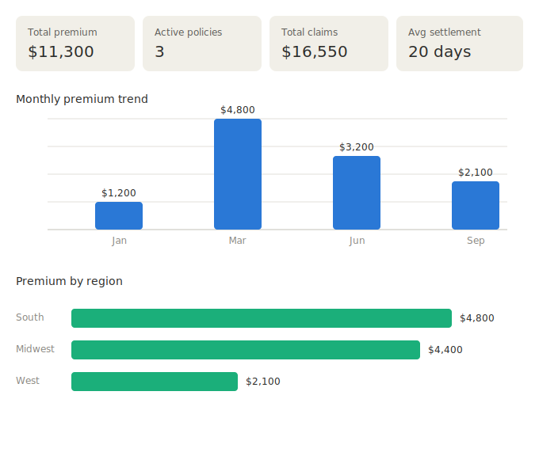

# 📈 Sample Dashboard Visual

> A static preview of what the **Premium Trend Dashboard** looks like when built in Business Objects, based on the sample dataset in `sample_table_data.md`.

> ⚠️ This is a **mockup for documentation purposes** — actual WebI dashboards are interactive with drill-down, prompts, and live data refresh.

---

## Premium Trend Dashboard — Preview

---

## What This Dashboard Shows

| Metric | Value |
|---|---|
| 💰 Total Premium | $11,300 |
| 📋 Active Policies | 3 |
| 💸 Total Claims | $16,550 |
| ⏱️ Average Settlement | 20 days |

**Monthly Premium Trend** — shows premium collected across January, March, June, and September 2024, with the highest collection month being March ($4,800).

**Premium by Region** — South leads with $4,800 in premium (via Maria Lopez), followed by Midwest at $4,400 (via John Carter) and West at $2,100 (via David Kim).

---

## Notes

- This static SVG is a GitHub-friendly substitute for the interactive WebI dashboard, which would normally include drill-down (year → quarter → month), filter prompts, and conditional formatting
- Data source: `sample_table_data.md` (`policy_fact`, `policy_dim`, `agent_dim`)
- For the full interactive version with hover tooltips, this was also demoed live in-chat as an HTML/Chart.js widget
