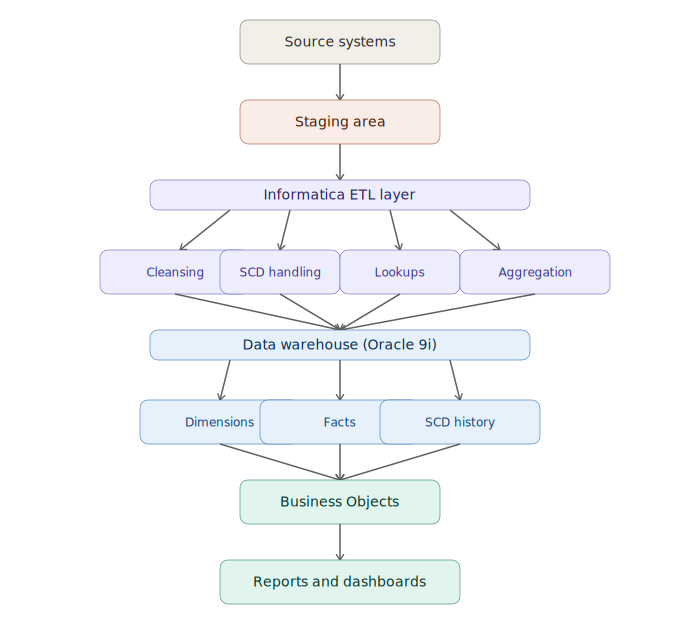

# 🔄 ETL Flow Diagram (Conceptual Documentation)

> The end-to-end data pipeline for the **Insurance Data Warehouse** — from source systems to business reporting.

---

## 1️⃣ Introduction

This document explains the **end-to-end ETL flow** used in the Data Warehousing Insurance Group project. It captures how data moves through:

```
Source Systems → Staging → Transformations → Warehouse → Reporting
```

> A visual ETL diagram helps developers, analysts, and auditors understand the **complete data pipeline**.

---

## 2️⃣ High-Level ETL Architecture



### 🧩 Components

| Layer | Details |
|---|---|
| 🏢 Source Systems | Policy, Claims, Customer, Agent systems |
| 📥 Staging Area (Oracle) | Raw extracted data loaded without transformations |
| 🔄 Informatica ETL Layer | Source Qualifier, Lookups, Expressions, Aggregators, Update Strategy, SCD Type 1 & 2 logic, Workflows & Sessions |
| 🗄️ Data Warehouse (Oracle 9i) | Fact tables, Dimension tables, SCD history |
| 📊 Business Objects Reporting Layer | Universe, WebI reports, Dashboards |

---

## 3️⃣ Detailed ETL Flow Description

### 🔹 Step 1 — Data Extraction
- Informatica connects to source systems
- Data pulled using **Source Qualifier**
- Loaded into staging tables **without transformations**

### 🔹 Step 2 — Data Cleansing
Performed using:
- Expression Transformation
- Lookup Transformation
- Filter Transformation

Cleansing includes:
- ✅ Removing duplicates
- ✅ Standardizing formats
- ✅ Validating mandatory fields

### 🔹 Step 3 — SCD Handling

| SCD Type | Action |
|---|---|
| Type 1 | Overwrite non-critical attributes |
| Type 2 | Insert new historical records |
| Type 3 | Maintain limited history |

### 🔹 Step 4 — Fact Table Loading
- Aggregations performed using **Aggregator Transformation**
- Surrogate keys resolved via **Lookup**
- Loaded into:
  - `Policy_Fact`
  - `Claim_Fact`

### 🔹 Step 5 — Dimension Table Loading
- `Customer_Dim`
- `Policy_Dim`
- `Agent_Dim`
- `Claim_Type_Dim`
- `Date_Dim`

### 🔹 Step 6 — Workflow Execution
- Workflows scheduled **daily**
- Sessions monitored via **Workflow Monitor**
- Error logs captured for debugging

### 🔹 Step 7 — Reporting Layer
- BO Universe maps DW tables
- Reports & dashboards built using **WebI**

---

## 4️⃣ Conceptual ETL Flow Diagram (Textual Representation)

```
          +------------------+
          |  Source Systems  |
          +------------------+
                    |
                    v
          +------------------+
          |   Staging Area   |
          +------------------+
                    |
                    v
          +------------------+
          |   ETL Layer      |
          | (Informatica)    |
          +------------------+
        /    |      |       \
       v     v      v        v
  Cleansing  SCD   Lookups   Aggregation
                    |
                    v
          +------------------+
          | Data Warehouse   |
          |  (Oracle 9i)     |
          +------------------+
        /         |          \
       v          v           v
  Dimensions    Facts     SCD History
                    |
                    v
          +------------------+
          | Business Objects |
          +------------------+
                    |
                    v
          +------------------+
          | Reports & Dash   |
          +------------------+
```

---

## 5️⃣ Business Value of ETL Flow

- ✅ Ensures clean, validated, reliable data
- 🕘 Maintains historical accuracy via SCD
- ⚡ Enables fast reporting and analytics
- 🎯 Provides a single source of truth
- 📋 Supports regulatory compliance

---

## 6️⃣ Outcome

This ETL flow forms the **backbone** of the insurance data warehouse.

> It ensures that data is consistently extracted, transformed, and loaded into a structure optimized for **analytics and reporting**. 🚀
